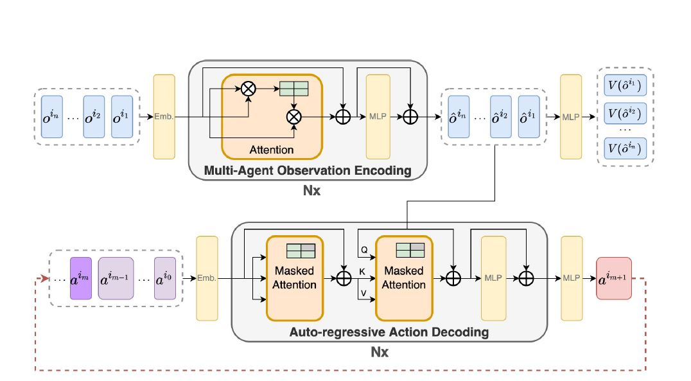
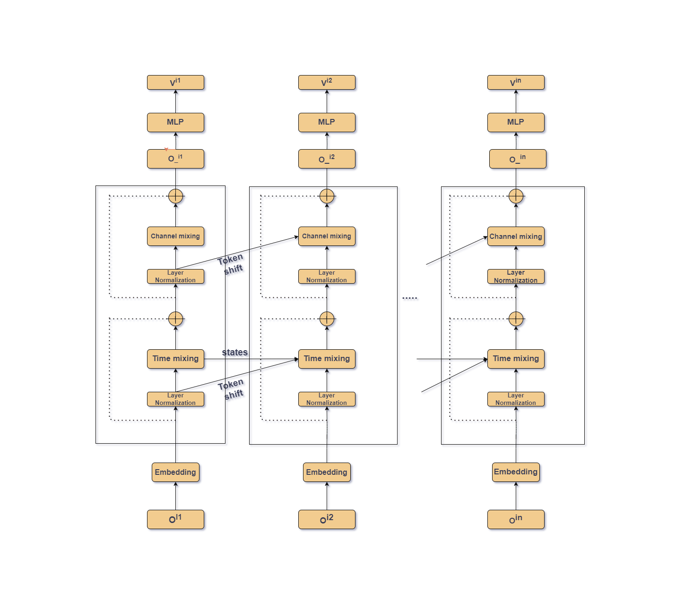
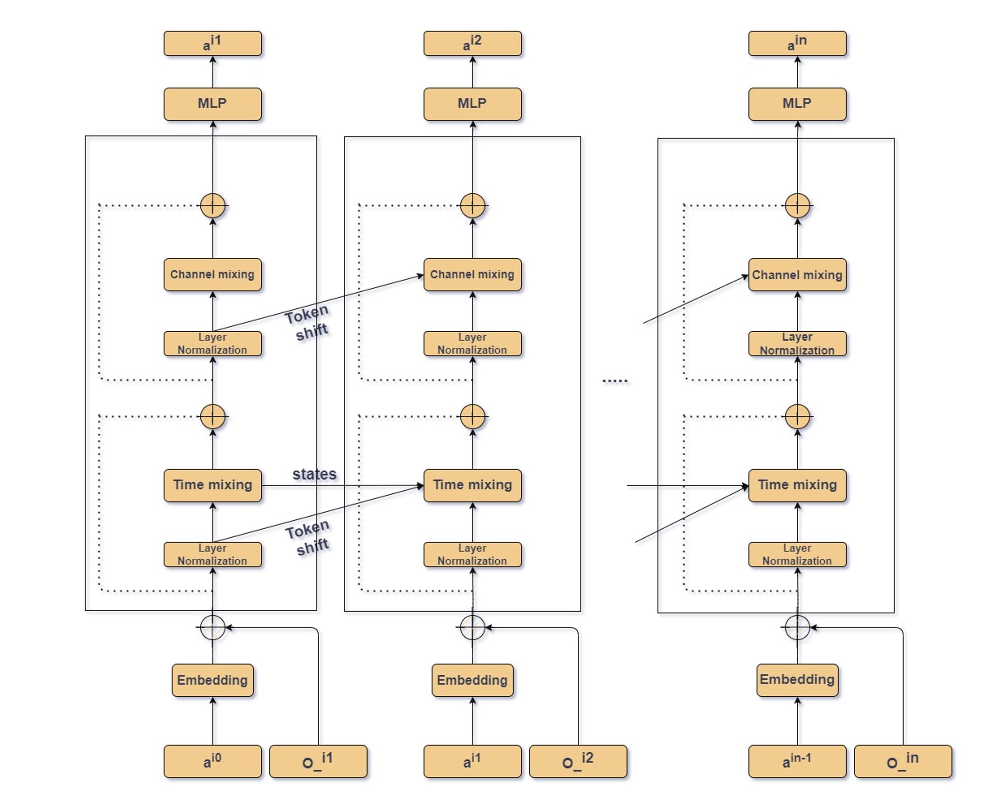
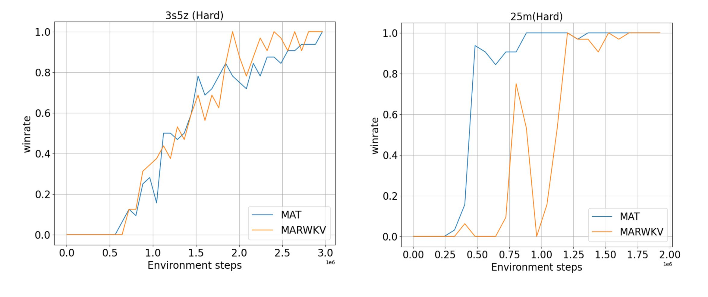
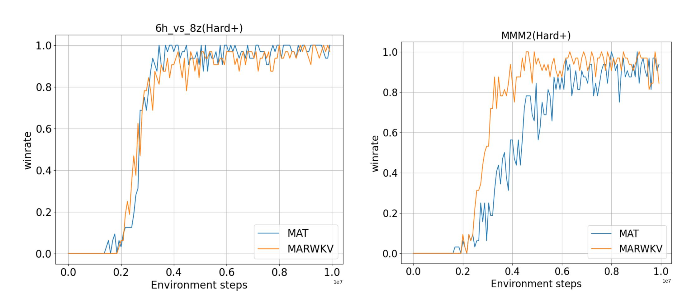
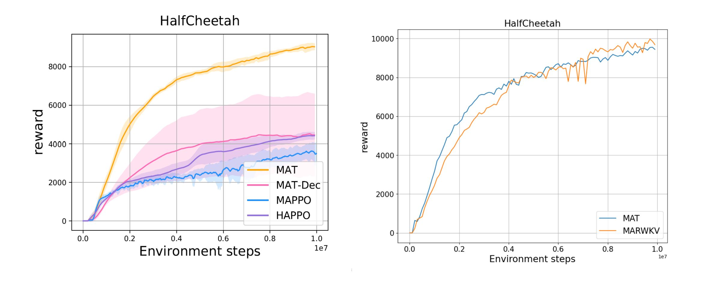
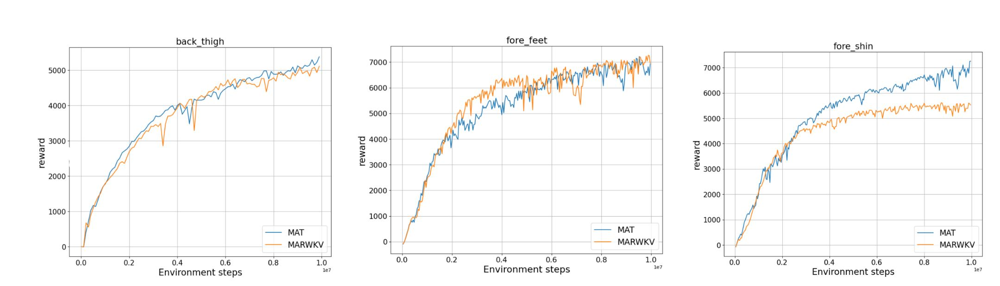
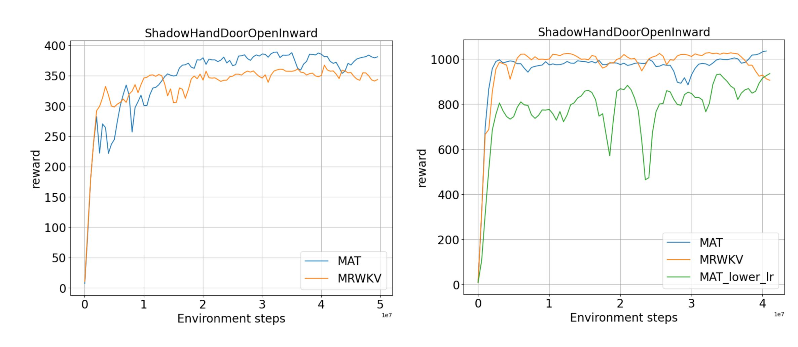

This repository contains implementation of MAT, forked from https://github.com/PKU-MARL/Multi-Agent-Transformer.git and implementation of MARWKV (implementation of RWKV architecture for sequence modelling in MARL) which are available as algorithm options for MAT; rwkv code implementation was adpated from [[rwkv github code]](https://github.com/BlinkDL/RWKV-LM). This repository is part of a academic course Practical Work in AI (Master).

**For more details, one can go through the report uploaded in the same repository.**


## Installation

### Dependences
``` Bash
pip install -r requirements.txt
```

### Multi-agent MuJoCo
Following the instructios in https://github.com/openai/mujoco-py and https://github.com/schroederdewitt/multiagent_mujoco to setup a mujoco environment. In the end, remember to set the following environment variables:
``` Bash
LD_LIBRARY_PATH=${HOME}/.mujoco/mujoco200/bin;
LD_PRELOAD=/usr/lib/x86_64-linux-gnu/libGLEW.so
```

### StarCraft II & SMAC
Run the script
``` Bash
bash install_sc2.sh
```
Or you could install them manually to other path you like, just follow here: https://github.com/oxwhirl/smac.


### Bi-DexHands 
Please following the instructios in https://github.com/PKU-MARL/DexterousHands. 


## How to run
When the environment is ready, one could run shells in the "scripts" folder with algo="mat" or algo="marwkv_v4". For example:
``` Bash
./train_mujoco.sh  # run MAT/MARWKV on Multi-agent MuJoCo
```
If you would like to change the configs of experiments, you could modify sh files or look for config.py for more details.

## MAT and MARWKV architecture
*MAT encoder-decoder*


*MARWKV encoder*


*MARWKV decoder*



## Some experiments results

### SMAC challenge
*Performance of MAT and MARWKV on hard SMAC maps*


*Performance of MAT and MARWKV on very hard SMAC maps*


### MuJoCo challenge
*Performance on halfcheetah challenge*


*Performance on halfcheetah with disabled joints*



### Bidex hands Challenge
*Performance on bidex hands challenges*


